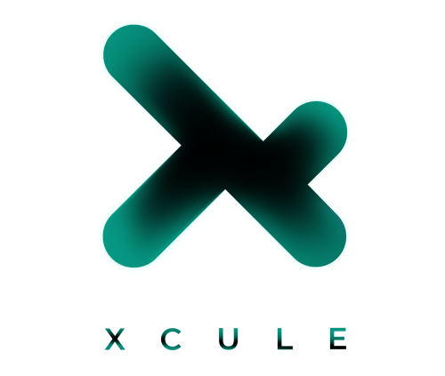

# Xcule



Xcule is a revolutionary trading analysis tool designed for every trader out there! Whether you're into SMC or ICT trading, Xcule has got you covered. 
Dive deep into the world of technical analysis with our advanced features tailored to visualize Institutional Trading Strategies.

## Features

- **Real-time market data & multiple chart views**
- **Built-in indicators** like RSI, EMA, MACD, Bollinger Bands, and more!
- **Effortlessly draw Market Structure, BOS, and view Supply and Demand zones** with the SMC visualizer
- **Uncover fair value gaps and market manipulations** using the ICT visualizer
- **Test and refine your trading strategies** by replaying candle bars – available even in 1, 3, and 5-minute timeframes!
- **Automated SMC chart drawing capability** for SMC traders

## Demo

Check out our demo video on YouTube: [Xcule Features Video](https://youtu.be/oFk-KcKAiCI)

<iframe width="560" height="315" src="https://www.youtube.com/embed/oFk-KcKAiCI" frameborder="0" allow="accelerometer; autoplay; clipboard-write; encrypted-media; gyroscope; picture-in-picture" allowfullscreen></iframe>


## Getting Started

### Prerequisites

- Docker
- Docker Compose

### Installation

1. **Clone the repository:**

   ```sh
   git clone https://github.com/yourusername/xcule.git
   cd xcule
Create a .env file:

Create a .env file in the root directory with the following content:


MONGODB_USER=your_mongo_user
MONGODB_PASSWORD=your_mongo_password
MONGO_DB_HOST=your_mongo_host
MONGODB_DOCKER_PORT=27017
MONGO_DB_SERVER=mongodb
MONGO_DB_NAME=your_db_name
EXPRESS_PORT=3000
EXPRESS_SOCKET_PORT=3001
FLASK_PORT=5000
FLASK_HOST=0.0.0.0
MONGO_EXPRESS_PORT=8081
MONGO_EXPRESS_USER=your_express_user
MONGO_EXPRESS_PASSWORD=your_express_password
Build and run the services:


docker-compose up --build
Services
Node.js Service: Fetches real-time indicator data from TradingView charts.
Flask Service: Loads Smart Money Concepts (SMC) information such as Market Structure, Supply & Demand zones, Imbalance Zones, etc.
MongoDB Service: Stores trading data.
Mongo Express Service: Provides a web-based interface for MongoDB.
Usage
Access the Node.js API:

Open your browser and go to http://localhost:3000.

Access the Flask API:

Open your browser and go to http://localhost:5000.

Access Mongo Express:

Open your browser and go to http://localhost:8081.

Contributing
Contributions are what make the open-source community such an amazing place to learn, inspire, and create. Any contributions you make are greatly appreciated.

Fork the Project
Create your Feature Branch (git checkout -b feature/AmazingFeature)
Commit your Changes (git commit -m 'Add some AmazingFeature')
Push to the Branch (git push origin feature/AmazingFeature)
Open a Pull Request
License
Distributed under the MIT License. See LICENSE for more information.

Contact
Ryan Saleh - @MohdSaleh | hello@ryansaleh.com

Project Link: https://github.com/MohdSaleh/xcule

Acknowledgements
TradingView
Docker
MongoDB
Mongo Express

Made with ❤️ by Ryan Saleh


### Notes

- Replace placeholders like `yourusername`, `your_mongo_user`, `your_mongo_password`, etc., with actual values.
- Add a logo image to the `path/to/your/logo.png` if you have one.
- Customize the contact information and acknowledgments as needed.
